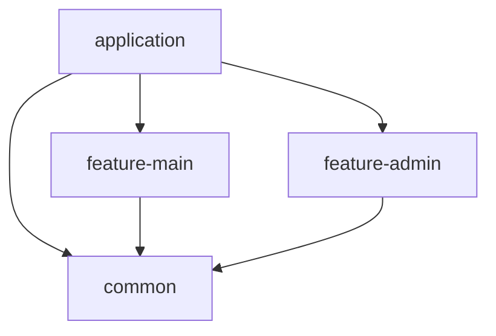

# Spring Boot Modular Monolith Application

このプロジェクトは、Spring Boot 3.5 と Java 21 を使用した**モジュラーモノリス (Modular Monolith)** アーキテクチャのサンプルアプリケーションです。
機能ごとにモジュールを分割し、保守性と拡張性を高める構成を採用しています。インフラストラクチャとして PostgreSQL と LocalStack (S3) を Docker Compose で提供します。

## 📖 目次

- [アーキテクチャ](#-アーキテクチャ)
- [技術スタック](#-技術スタック)
- [前提条件](#-前提条件)
- [環境構築と実行](#-環境構築と実行)
  - [Docker Compose での実行（推奨）](#docker-compose-での実行推奨)
  - [ローカルでの開発・実行](#ローカルでの開発実行)
- [ディレクトリ構成](#-ディレクトリ構成)
- [設定と環境変数](#-設定と環境変数)

## 🏗 アーキテクチャ

本プロジェクトは Gradle のマルチモジュール構成を採用しており、以下のような依存関係を持っています。



- **application**: アプリケーションのエントリーポイント。設定、セキュリティ、DB接続設定などを集約し、実行可能な JAR を生成します。
- **feature-main**: 主要なドメインロジックを提供する機能モジュールです。
- **feature-admin**: 管理者向け機能を提供する機能モジュールです。
- **common**: 全モジュールで共有されるユーティリティ、例外ハンドリング、共通設定などを含みます。

## 🛠 技術スタック

- **言語**: Java 21
- **フレームワーク**: Spring Boot 3.5.0
- **ビルドツール**: Gradle
- **データベース**:
  - PostgreSQL 17 (本番・開発用 / Docker)
  - H2 Database (テスト用 / In-Memory)
- **クラウドエミュレーション**: LocalStack (AWS S3)
- **認証・認可**: Spring Security, OAuth2 Resource Server
- **API ドキュメント**: SpringDoc OpenAPI (Swagger UI)
- **コンテナ化**: Docker, Docker Compose

## ✅ 前提条件

ローカルで開発・実行するためには以下のツールが必要です。

- **Java Development Kit (JDK) 21**
- **Docker Desktop** (または Docker Engine + Docker Compose)

## 📖 API ドキュメント

アプリケーション起動後、以下のURLで API ドキュメントを確認できます。

- **Swagger UI**: [http://localhost:8080/swagger-ui/index.html](http://localhost:8080/swagger-ui/index.html)
- **OpenAPI 定義**: [http://localhost:8080/v3/api-docs](http://localhost:8080/v3/api-docs)

API定義ファイルは `open-api.yml` としてプロジェクトルートにも配置されています。

## 🚀 環境構築と実行

### Docker Compose での実行（推奨）

データベース、LocalStack、およびアプリケーションを一括で起動します。

```bash
# アプリケーションのビルドとコンテナ起動
docker compose up -d --build
```

起動後、アプリケーションは `http://localhost:8080` でアクセス可能です。

- **DB**: `localhost:5432` (User: postgres, Pass: password, DB: demo_db)
- **LocalStack**: `localhost:4566`

停止する場合:

```bash
docker compose down
```

### ローカルでの開発・実行

IDE (IntelliJ IDEA 等) や Gradle を使用してローカルで実行する場合、依存するサービス (DB, LocalStack) を先に起動しておく必要があります。

1. **インフラの起動** (アプリケーション本体は除外)
   ```bash
   docker compose up -d db localstack
   ```

2. **アプリケーションの実行**
   ```bash
   ./gradlew :application:bootRun
   ```

3. **テストの実行**
   ```bash
   ./gradlew test
   ```

## 📂 ディレクトリ構成

```text
.
├── application/      # エントリーポイント、設定、結合テスト
├── common/           # 共通ライブラリ、例外クラス、ユーティリティ
├── feature-admin/    # 管理機能モジュール
├── feature-main/     # メイン機能モジュール
├── docker-compose.yml # インフラ構成定義
├── Dockerfile        # アプリケーションのコンテナ定義
├── build.gradle      # ルートビルド設定
└── init.sql          # DB初期化スクリプト
```

## ⚙ 設定と環境変数

主な環境変数は `docker-compose.yml` および `application/src/main/resources/application.yml` で定義されています。

| 環境変数名 | デフォルト値 | 説明 |
| --- | --- | --- |
| `SPRING_DATASOURCE_URL` | `jdbc:postgresql://db:5432/demo_db` | DB接続URL |
| `SPRING_DATASOURCE_USERNAME` | `postgres` | DBユーザー名 |
| `SPRING_DATASOURCE_PASSWORD` | `password` | DBパスワード |
| `AWS_ENDPOINT` | `http://localstack:4566` | AWS エンドポイント (LocalStack用) |

### AWS S3 設定 (LocalStack)
開発環境では LocalStack を使用して S3 をエミュレートします。コード内では `S3Config` (commonモジュール) を通じてクライアントが提供されます。

---
© 2024 Demo Application
